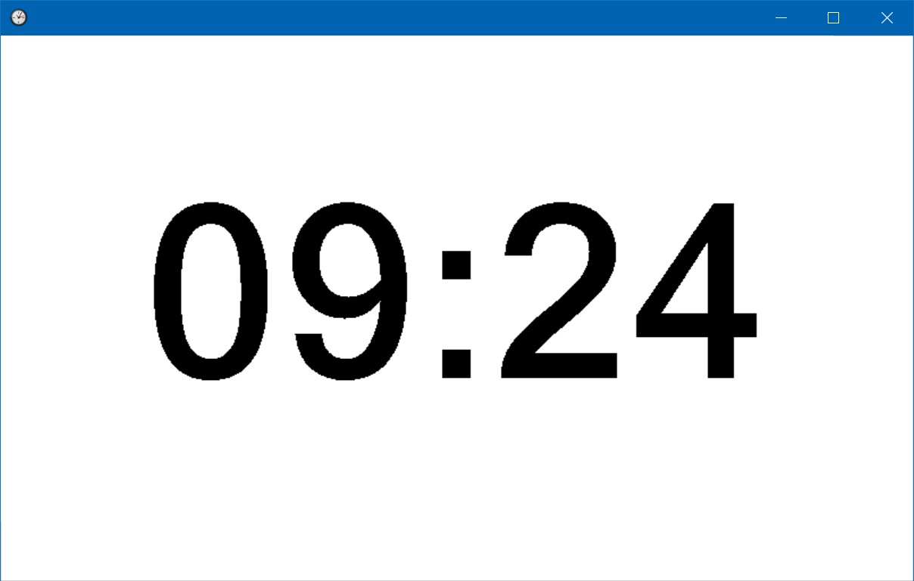

TimeKeeper
=========

Timekeeper is a very simple tool, displaying a countdown timer. 

1. Start it
2. Doubleclick and set the number of minutes for the countdown
3. the countdown is diisplayed.
4. Resize the windows are you need it

Its a very simple tool - we use it regularily for breaks in workshops or virtual meetings or time-capped presentations.

[Download Binary Timekeeper.exe](bin/Release/)
